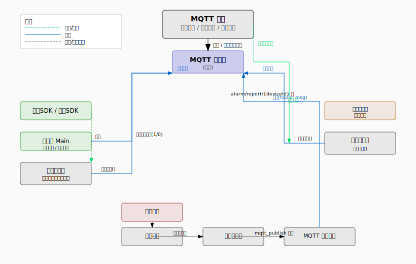

# Server MQTT 消息推送架构总结

本文档梳理当前 SenHub 网关服务中 MQTT 的用途、主题、消息格式与集成方式，与 [mqtt-message-body-spec.md](mqtt-message-body-spec.md) 规范一致。

---

## 1. 概述

- **目的**：厘清 MQTT 在“网关上下线、设备/装置状态、工作流报警与订阅”中的使用方式；明确 senhub/* 主题与消息体约定。
- **范围**：基于 `server` 模块内 `mqtt`、`command`、`device`、`workflow` 等包的实际实现归纳，配置以 `config.yaml` 及 `Config.MqttConfig` 为准。

---

## 2. 主题与角色

| 主题配置项 | 默认值 | 方向 | 用途 |
|------------|--------|------|------|
| `status_topic` | `senhub/device/status` | 网关 → Broker | 设备/雷达上下线与状态（entity_type=camera/radar） |
| `command_topic` | `senhub/command` | Broker → 网关 | 接收控制命令（抓图、重启、回放、云台等） |
| `response_topic` | `senhub/response` | 网关 → Broker | 命令执行结果响应 |
| `gateway_status_topic` | `senhub/gateway/status` | 网关 → Broker | 网关上下线/故障（LWT + 上线） |
| `report_topic_prefix` | `senhub/report` | 网关 → Broker | 报警/工作流上报，实际为 senhub/report/{deviceId} |
| 工作流 mqtt_subscribe | 流程内配置 | Broker → 网关 | 按主题触发工作流 |

说明：网关自身上线/下线使用 **senhub/gateway/status**，设备/雷达使用 **senhub/device/status**，装置使用 **senhub/assembly/{assemblyId}/status**。

---

## 3. 服务运行相关的系统 MQTT 消息

### 3.1 心跳与保活

- **协议层**：连接时设置 `KeepAliveInterval`（来自配置 `keep_alive`，最小 60 秒），由 Paho 与 Broker 做 TCP/MQTT 保活。
- **应用层**：无额外“心跳主题”发布。

### 3.2 系统上线/下线遗嘱（LWT）

- **已实现**：`MqttClient` 连接时使用本机 **MAC 地址** 作为 `gateway_id`，并调用 `setWill(gateway_status_topic, offline payload)`；异常断开时由 Broker 代为发布 offline。
- 连接成功后，向 **senhub/gateway/status** 发布一条 **online** 消息，payload 含 `type`、`gateway_id`（MAC）、`timestamp` 等。

### 3.3 默认命令主题订阅与处理

- 连接成功后，订阅 **command_topic**（默认 `senhub/command`）以及工作流中 **mqtt_subscribe** 节点配置的主题（去重）。
- 收到消息后：按主题派发——若为 command_topic 则走 `CommandHandler.handleCommand`，响应通过 `MqttPublisher.publishResponse` 发往 `response_topic`；若为 mqtt_subscribe 主题则查找以该主题为入口的流程并执行。

### 3.4 命令主题接收消息格式（约定）

- **主题**：`senhub/command`（可配置）。
- JSON 体，**必填**：`command`、`device_id`；**可选**：`request_id`、以及各命令所需参数。`device_id` 可为**国标 20 位**或**虚拟 ID**（`v_`+UUID）。

| 字段 | 类型 | 必填 | 说明 |
|------|------|------|------|
| `command` | string | 是 | 见下表 |
| `device_id` | string | 是 | 国标 ID 或虚拟 ID |
| `request_id` | string | 否 | 用于与响应关联 |

**支持的 command 类型**：`capture`、`reboot`、`playback`、`play_audio`、`ptz_control`。  
部分命令支持顶层参数（如 `ptz_control` 的 `action`、`speed`、`channel`；`playback` 的 `start_time`、`end_time`、`channel`）。

示例（抓图）：

```json
{
  "command": "capture",
  "device_id": "34020000001320000001",
  "request_id": "uuid-optional"
}
```

### 3.5 响应主题发送格式

与 `CommandResponse` 对应，JSON 字段：

| 字段 | 类型 | 说明 |
|------|------|------|
| `requestId` | string | 与请求中的 request_id 对应 |
| `deviceId` | string | 设备 ID |
| `command` | string | 执行的命令类型 |
| `success` | boolean | 是否成功 |
| `data` | object | 成功时的结果（如抓图 base64、回放列表等） |
| `error` | string | 失败时的错误信息 |

示例（成功）：

```json
{
  "requestId": "req-1",
  "deviceId": "192.168.1.100",
  "command": "capture",
  "success": true,
  "data": {
    "image_base64": "...",
    "image_size": 12345,
    "channel": 1,
    "timestamp": "20250129120000"
  },
  "error": ""
}
```

---

## 4. 设备/装置/雷达状态的系统 MQTT 消息

### 4.1 发布时机

- **设备状态变更**：SDK 回调或保活检测 → `DeviceManager.publishDeviceStatus` → **MqttPublisher** 发布到 `senhub/device/status`，payload 含 `entity_type=camera`、`device_id`、`device_info`（含 `camera_type`、`serial_number`）。
- **雷达状态**：雷达上线/状态变更 → Main 中 `publishRadarStatus` → 同一主题 `senhub/device/status`，`entity_type=radar`、`radar_info`。
- **装置状态**：装置上下线/关联变更 → `publishAssemblyStatus` → **senhub/assembly/{assemblyId}/status**，payload 含 `longitude`、`latitude`、`device_ids`。

### 4.2 使用主题

- **设备/雷达**：配置的 **status_topic**（默认 `senhub/device/status`）。
- **网关**：**gateway_status_topic**（默认 `senhub/gateway/status`），与设备状态分离。
- **装置**：固定为 `senhub/assembly/{assemblyId}/status`。

### 4.3 设备/雷达消息体字段

| 字段 | 类型 | 说明 |
|------|------|------|
| `entity_type` | string | camera / radar |
| `device_id` | string | 国标 20 位或虚拟 ID |
| `type` | string | online / offline |
| `timestamp` | long | Unix 秒 |
| `device_info` / `radar_info` | object | 摄像头含 name、ip、port、rtsp_url、brand、**camera_type**、**serial_number**；雷达含 radar_ip、radar_name、assembly_id 等 |

示例（摄像头上线）：

```json
{
  "entity_type": "camera",
  "device_id": "34020000001320000001",
  "type": "online",
  "timestamp": 1738147200,
  "device_info": {
    "name": "前门球机",
    "ip": "192.168.1.100",
    "port": 8000,
    "rtsp_url": "rtsp://...",
    "brand": "hikvision",
    "camera_type": "ptz",
    "serial_number": ""
  }
}
```

---

## 5. 工作流中的 MQTT 节点（报警推送与订阅）

### 5.1 节点类型

- **mqtt_publish**：发送节点，处理器为 `MqttPublishHandler`，依赖 **MqttPublisher** 接口发布。
- **mqtt_subscribe**：**已实现**。流程起始节点类型，配置 topic（及可选 qos）；流程加载时收集所有 mqtt_subscribe 的 topic 去重后由 MQTT 客户端订阅；消息到达时按主题查找以该 topic 为入口的流程，构造 FlowContext 并执行。

### 5.2 报警到 MQTT 的链路

设备报警 → `AlarmService.handleAlarm` → 规则匹配 → 执行关联工作流 → 若流程包含 `mqtt_publish` 节点 → `MqttPublishHandler.execute` → **MqttPublisher.publish** 发送。payload 中增加 **event_id**（1000～2000，由 event_key 查 canonical_events）、**event_key**，与 [mqtt-message-body-spec.md](mqtt-message-body-spec.md) 一致；同一事件在三阶段中 event_id 一致。

### 5.3 主题模板

节点配置中的 `topic` 支持模板变量（由 `HandlerUtils.renderTemplate` 替换）：

| 变量 | 含义 |
|------|------|
| `{deviceId}` | 设备 ID（国标或虚拟 ID） |
| `{assemblyId}` | 装置 ID |
| `{alarmType}` / `{eventKey}` | 事件键 |
| `{flowId}` | 工作流 ID |

默认使用 **report_topic_prefix** 规范，如 `senhub/report/{deviceId}`。

### 5.4 发送消息体（payload）

由 `AlarmService.buildFlowContext` 与 `MqttPublishHandler` 组装：含 **event_id**、**event_key**、device_id、assembly_id、channel、timestamp、source_brand、source_code、flow_id、capture_url、oss_url、extra 等，与规范一致。

---

## 6. 集成度与独立性

- **集成方式**：业务层依赖 **MqttPublisher** 接口；实际实现为 **DelegatingMqttPublisher**（连接时委托 **MqttClientAdapter** 封装 `MqttClient`，断开时自动切换为 **FallbackMqttPublisher** 仅写日志）。`AlarmService`、`DeviceManager`、`Main`、`MqttPublishHandler`、`CommandHandler` 等均通过 MqttPublisher 发布，无连接时自动降级。
- **配置**：Broker、clientId、用户名密码、status_topic、command_topic、response_topic、**gateway_status_topic**、**report_topic_prefix**、qos、keep_alive 来自 `Config.MqttConfig`，可由 API 与 `ConfigService` 读写；重启 MQTT 通过 `SystemController.restartMqtt` 实现。
- **订阅**：除 command_topic 外，**mqtt_subscribe** 节点配置的主题在流程加载时收集并订阅，消息到达时按主题派发工作流。

---

## 7. 架构图

下图概括当前 MQTT 数据流与主题关系（订阅/发布及主要组件）。



- **绿色虚线**：订阅/接收（command_topic → CommandHandler）。
- **蓝色实线**：发布（status_topic、response_topic、工作流自定义 topic）。
- **灰色虚线**：SDK 回调或内部调用。

---

## 8. 已实现项（与规范对齐）

| 项 | 说明 |
|----|------|
| **LWT** | 已实现：`gateway_status_topic`（senhub/gateway/status），连接时 setWill，异常断开时 Broker 代为发布 offline。 |
| **网关上下线主题** | 已实现：网关上线/下线与设备状态分离，网关使用 senhub/gateway/status，gateway_id 为本机 MAC。 |
| **设备/雷达/装置状态** | 已实现：设备/雷达统一 senhub/device/status（entity_type、device_info/radar_info）；装置 senhub/assembly/{id}/status（含经纬度、device_ids）。 |
| **工作流 mqtt_subscribe** | 已实现：节点类型 mqtt_subscribe，按主题订阅并在消息到达时触发流程。 |
| **报警 event_id** | 已实现：payload 含 event_id（1000～2000）、event_key，三阶段同 event_id。 |
| **MqttPublisher 与降级** | 已实现：MqttPublisher 接口、MqttClientAdapter、FallbackMqttPublisher、DelegatingMqttPublisher，无连接时自动降级写日志。 |

---

*文档基于当前代码与配置整理，若实现或配置变更请同步更新本文档。*
