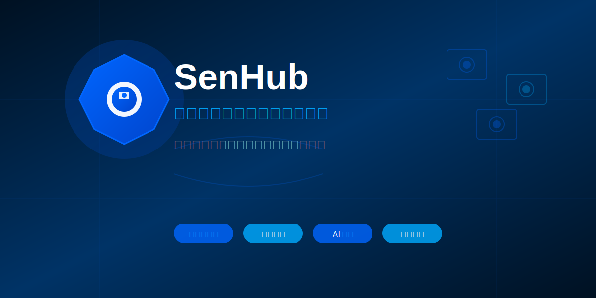

<div align="center">


# SenHub — 多品牌视频监控报警统一中枢

**面向智能安防场景的综合性数字视频监控网关系统**

[](LICENSE)
[](https://www.oracle.com/java/)
[](https://maven.apache.org/)
[](https://github.com/GQ-Y/SenHub)

**一平台纳管全品牌，一事件触发全智能**

[English](README.en.md) | [中文](README.md)

[快速开始](#快速开始) • [核心功能](#核心功能) • [技术文档](#技术文档) • [贡献指南](#贡献指南)

</div>

---

## 项目简介

SenHub 是一款面向智能安防场景的综合性数字视频监控网关系统，深度集成海康、大华、天地伟业等主流厂商摄像头 SDK，打破品牌壁垒，实现报警事件的统一接入、标准化处理与智能分发。系统可实时抓取图像、控制云台，并集中接收各类设备触发的报警信号（如移动侦测、越界、设备异常等），通过 MQTT、Webhook 等开放协议，将结构化报警事件毫秒级推送至 AI 分析平台、运维系统或指挥中心。

SenHub 不仅大幅简化多品牌设备的集成复杂度，更作为 AI 多模态视觉大模型的理想前端入口，为智能诊断、风险预警与自动化响应提供高质量、低延迟的事件驱动基础，真正实现"一平台纳管全品牌，一事件触发全智能"。



## 快速开始

> 在安装 SenHub 之前，请确保您的设备满足最低要求：
>
> - **操作系统**: Linux (ARM64 或 x86_64)
> - **CPU**: ≥ 2 核
> - **内存**: ≥ 2 GB RAM
> - **存储**: ≥ 5 GB 可用空间
> - **Java**: 11 或更高版本
> - **Maven**: 3.6 或更高版本
> - **MQTT 服务器**: 可访问的 MQTT Broker

### 1. 准备 SDK 库文件

将各品牌 SDK 库文件复制到 `lib/` 目录下：

```bash
cd server
mkdir -p lib/arm/hikvision lib/arm/dahua lib/x86/hikvision lib/x86/tiandy lib/x86/dahua

# 示例：复制海康威视 ARM SDK
cp -r /path/to/HCNetSDK/arm64/* lib/arm/hikvision/

# 示例：复制天地伟业 x86 SDK
cp -r /path/to/TiandySDK/x86/* lib/x86/tiandy/
```

### 2. 编译项目

```bash
cd server
mvn clean package
```

### 3. 配置系统

编辑 `src/main/resources/config.yaml` 文件，配置 MQTT 服务器地址、设备认证信息等：

```yaml
mqtt:
  broker: "tcp://your-mqtt-broker:1883"
  client_id: "senhub-gateway"
  username: "your-username"
  password: "your-password"
```

### 4. 运行服务

```bash
# 方式1：使用 Maven 运行
mvn exec:java -Dexec.mainClass="com.digital.video.gateway.Main"

# 方式2：运行打包后的 jar
java -jar target/video-gateway-service-1.0.0.jar
```

服务启动后，默认 HTTP API 端口为 `8080`，可通过 `http://localhost:8080` 访问管理界面。

## 核心功能

### 多品牌统一接入

- ✅ **海康威视 (Hikvision)** - 完整 SDK 集成，支持设备发现、控制、报警接收
- ✅ **大华 (Dahua)** - 全功能支持，包括云台控制、录像回放
- ✅ **天地伟业 (Tiandy)** - 深度集成，支持多通道设备管理
- ✅ **自动设备发现** - 局域网自动扫描，智能识别设备品牌和型号
- ✅ **统一设备管理** - 跨品牌设备统一管理界面，集中配置和监控

### 报警事件统一处理

- ✅ **多类型报警接收** - 移动侦测、越界、设备异常、入侵检测等
- ✅ **标准化事件格式** - 统一的事件数据结构，便于下游系统处理
- ✅ **毫秒级事件推送** - 通过 MQTT、Webhook 实时推送报警事件
- ✅ **报警规则引擎** - 灵活的规则配置，支持复杂报警逻辑
- ✅ **报警历史记录** - 完整的报警事件历史查询和统计

### 实时图像与云台控制

- ✅ **实时图像抓取** - 支持 Base64 编码或文件上传
- ✅ **云台控制 (PTZ)** - 上下左右转动、变焦、预置位
- ✅ **录像回放** - 支持时间段录像查询和下载
- ✅ **音频播放** - 支持设备端音频播放功能
- ✅ **PTZ 位置监控** - 实时监控球机位置状态

### AI 多模态视觉大模型前端入口

- ✅ **高质量图像输出** - 为 AI 分析提供标准化图像数据
- ✅ **低延迟事件驱动** - 毫秒级事件推送，满足实时 AI 分析需求
- ✅ **结构化数据输出** - 设备信息、报警事件、图像元数据统一格式
- ✅ **工作流引擎** - 可视化工作流配置，支持 AI 分析结果联动

### 开放协议集成

- ✅ **MQTT 协议** - 标准 MQTT 3.1.1/5.0 支持，QoS 保证
- ✅ **Webhook 回调** - HTTP/HTTPS Webhook 支持，企业微信、钉钉、飞书集成
- ✅ **RESTful API** - 完整的 REST API，支持设备管理、配置、查询
- ✅ **WebSocket** - 实时数据推送，支持前端实时监控

### 设备管理与监控

- ✅ **设备状态监控** - 实时监控设备在线/离线状态
- ✅ **自动保活机制** - 自动检测设备连接，断线重连
- ✅ **设备信息管理** - IP、端口、RTSP 地址、通道信息等
- ✅ **批量操作** - 支持批量设备配置和管理
- ✅ **设备分组** - 支持设备分组管理，便于大规模部署

### 工作流引擎

- ✅ **可视化流程配置** - 通过 API 或界面配置工作流
- ✅ **多节点支持** - 抓图、上传、通知、PTZ 控制等节点
- ✅ **事件触发** - 基于报警事件自动触发工作流
- ✅ **条件判断** - 支持复杂条件逻辑，灵活控制流程

### 数据存储

- ✅ **SQLite 数据库** - 轻量级本地数据库，存储设备信息和配置
- ✅ **OSS 对象存储** - 支持阿里云 OSS、MinIO 等对象存储
- ✅ **录像管理** - 自动录制和存储管理
- ✅ **日志系统** - 完整的日志记录和查询

## 技术文档

### 系统架构

```
┌─────────────────────────────────────────────────────────────┐
│                      SenHub Gateway                          │
├─────────────────────────────────────────────────────────────┤
│  ┌──────────┐  ┌──────────┐  ┌──────────┐                  │
│  │ 海康 SDK │  │ 大华 SDK │  │ 天地 SDK │  ...              │
│  └────┬─────┘  └────┬─────┘  └────┬─────┘                  │
│       │             │             │                          │
│       └─────────────┼─────────────┘                          │
│                     │                                         │
│  ┌──────────────────▼──────────────────┐                    │
│  │      统一设备管理层                  │                    │
│  │  - 设备发现与注册                    │                    │
│  │  - 状态监控与保活                    │                    │
│  │  - 命令路由与处理                    │                    │
│  └──────────────────┬──────────────────┘                    │
│                     │                                         │
│  ┌──────────────────▼──────────────────┐                    │
│  │      事件处理引擎                    │                    │
│  │  - 报警事件接收                      │                    │
│  │  - 事件标准化处理                    │                    │
│  │  - 工作流执行                        │                    │
│  └──────────────────┬──────────────────┘                    │
│                     │                                         │
│  ┌──────────────────▼──────────────────┐                    │
│  │      开放协议接口                    │                    │
│  │  - MQTT 发布/订阅                    │                    │
│  │  - Webhook 回调                      │                    │
│  │  - RESTful API                       │                    │
│  └──────────────────────────────────────┘                    │
└─────────────────────────────────────────────────────────────┘
         │                    │                    │
         ▼                    ▼                    ▼
    AI 分析平台          运维系统            指挥中心
```

### 项目结构

```
server/
├── src/
│   ├── main/
│   │   ├── java/
│   │   │   └── com/digital/video/gateway/
│   │   │       ├── Main.java              # 主程序入口
│   │   │       ├── api/                   # REST API 控制器
│   │   │       ├── config/                # 配置管理
│   │   │       ├── hikvision/             # 海康威视 SDK 封装
│   │   │       ├── dahua/                 # 大华 SDK 封装
│   │   │       ├── tiandy/                # 天地伟业 SDK 封装
│   │   │       ├── mqtt/                  # MQTT 客户端
│   │   │       ├── device/                # 设备管理
│   │   │       ├── scanner/               # 设备扫描
│   │   │       ├── keeper/                # 保活系统
│   │   │       ├── command/               # 命令处理
│   │   │       ├── service/               # 业务服务层
│   │   │       ├── workflow/              # 工作流引擎
│   │   │       ├── database/              # 数据库访问
│   │   │       └── oss/                   # OSS 上传
│   │   └── resources/
│   │       ├── config.yaml                # 配置文件
│   │       └── logback.xml                 # 日志配置
├── lib/                                   # SDK 库文件目录
│   ├── arm/                               # ARM 架构库
│   │   ├── hikvision/
│   │   └── dahua/
│   └── x86/                               # x86 架构库
│       ├── hikvision/
│       ├── tiandy/
│       └── dahua/
├── pom.xml
└── README.md
```

### MQTT 主题与消息格式（senhub 规范）

网关采用 **senhub/** 主题前缀，设备/装置 ID 支持**国标 20 位**或**虚拟 ID**（`v_`+UUID）；国标 ID 由用户在前端主动设置，前端可调用「自动生成」获取建议。完整消息体规范见 [docs/mqtt-message-body-spec.md](../docs/mqtt-message-body-spec.md)。

#### 默认主题（config.yaml）

| 配置项 | 默认值 | 用途 |
|--------|--------|------|
| status_topic | senhub/device/status | 设备/雷达上下线与状态（entity_type=camera/radar） |
| command_topic | senhub/command | 控制命令接收 |
| response_topic | senhub/response | 命令响应 |
| gateway_status_topic | senhub/gateway/status | 网关上下线/故障（LWT + 上线） |
| report_topic_prefix | senhub/report | 报警/工作流上报，实际为 senhub/report/{deviceId} |

- **网关标识**：连接时使用本机 **MAC 地址** 作为 gateway_id，上线/离线消息发布到 `senhub/gateway/status`，并配置 LWT 异常断开时自动发布 offline。
- **装置状态**：发布到 `senhub/assembly/{assemblyId}/status`，payload 含经纬度、device_ids 等。

#### 设备/雷达状态（senhub/device/status）

```json
{
  "entity_type": "camera",
  "device_id": "34020000001320000001",
  "type": "online",
  "timestamp": 1738147200,
  "device_info": {
    "name": "前门球机",
    "ip": "192.168.1.100",
    "port": 8000,
    "rtsp_url": "rtsp://...",
    "brand": "hikvision",
    "camera_type": "ptz",
    "serial_number": ""
  }
}
```

雷达消息中 `entity_type` 为 `radar`，并携带 `radar_info` 对象。

#### 报警上报（senhub/report/{deviceId}）

报警 payload 包含 **event_id**（1000～2000，与 docs/mqtt-alarm-event-ids.csv 一致）、event_key、device_id、assembly_id 等；同一事件在三阶段（纯报警、带抓图、带回放）中 **event_id 一致**。

#### 命令下发与响应

- **订阅**：`senhub/command`；工作流中 **mqtt_subscribe** 节点配置的主题会一并订阅。
- **下发**：JSON 含 `command`、`device_id`（国标或虚拟 ID）、`request_id` 及各命令参数（如 capture、ptz_control、playback 等）。
- **响应**：发布到 `senhub/response`，含 requestId、deviceId、command、success、data/error。

### RESTful API

SenHub 提供完整的 RESTful API，支持设备管理、配置、查询等功能。

**基础 URL**: `http://localhost:8080/api`

主要接口包括：

- `GET /api/devices` - 获取设备列表
- `GET /api/devices/{deviceId}` - 获取设备详情
- `PUT /api/devices/{id}` - 更新设备（含 camera_type、serial_number）
- `GET /api/devices/suggest-gb-id` - 获取建议的国标 20 位 ID（前端“自动生成”用）
- `PUT /api/devices/:id/set-gb-id` - 设置设备国标 ID（请求体 `{ "gb_id": "20位" }`，会同步更新关联表）
- `POST /api/devices/{deviceId}/capture` - 抓图
- `POST /api/devices/{deviceId}/ptz` - 云台控制
- `GET /api/alarms` - 获取报警历史
- `POST /api/workflows` - 创建工作流

详细的 API 文档请参考代码中的 API 控制器类。

### 联调与验证建议

按 senhub 规范做端到端验证时，可订阅以下主题检查消息体：

- **senhub/gateway/status**：网关 online/offline，payload 含 `gateway_id`（本机 MAC）、`type`、`timestamp`。
- **senhub/device/status**：设备/雷达上下线，payload 含 `entity_type`（camera/radar）、`device_id`、`device_info`（含 `camera_type`、`serial_number`）或 `radar_info`。
- **senhub/assembly/+/status**：装置状态，含 `longitude`、`latitude`、`device_ids`。
- **senhub/report/+**：报警上报，含 `event_id`（1000～2000）、`event_key`、`device_id`。

命令下发使用 `senhub/command`，`device_id` 可为国标 20 位或虚拟 ID（`v_` 开头）；响应在 `senhub/response`。

### 配置说明

详细配置请参考 `src/main/resources/config.yaml` 文件中的注释。主要配置项包括：

- **MQTT 配置**: Broker 地址、认证信息、主题配置（status_topic、command_topic、response_topic、gateway_status_topic、report_topic_prefix）
- **设备配置**: 默认用户名密码、端口配置、品牌预设
- **扫描配置**: 自动扫描开关、扫描范围、扫描间隔
- **保活配置**: 检查间隔、离线判定阈值
- **OSS 配置**: 对象存储类型、认证信息、存储路径
- **日志配置**: 日志级别、文件路径、保留策略

### 数据库

使用 SQLite 存储设备信息、配置和报警记录，数据库文件位于 `data/devices.db`。

主要数据表：

- `devices` - 设备信息表（含 device_id 国标/虚拟 ID、camera_type、serial_number）
- `device_ptz_extension` - 设备 PTZ 扩展信息
- `assemblies` - 装置表（含 longitude、latitude）
- `canonical_events` - 标准事件表（含 event_id 1000～2000，与 mqtt-alarm-event-ids.csv 一致）
- `alarm_rules` - 报警规则表
- `alarm_records` - 报警记录表
- `workflows` - 工作流配置表（支持 mqtt_subscribe 起始节点）
- `system_config` - 系统配置表

## 注意事项

1. **架构要求**: SDK 库文件需要匹配系统架构（ARM64 或 x86_64），请确保使用正确的库文件
2. **库文件路径**: 确保 SDK 库文件路径正确，程序会通过 JNA 加载这些库
3. **权限要求**: 需要足够的权限访问网络和文件系统
4. **MQTT 连接**: 确保 MQTT 服务器可访问，否则无法上报状态和接收命令
5. **SDK 许可证**: 本项目基于各厂商 SDK 开发，请遵守相应 SDK 的许可证要求

## 开发说明

### SDK 封装

SDK 封装位于以下包中：

- `com.digital.video.gateway.hikvision` - 海康威视 SDK 封装
- `com.digital.video.gateway.dahua` - 大华 SDK 封装
- `com.digital.video.gateway.tiandy` - 天地伟业 SDK 封装

所有 SDK 封装使用 JNA (Java Native Access) 调用各品牌 SDK 的 C 接口。

### 添加新功能

1. **添加新的命令处理**:

   - 在 `com.digital.video.gateway.command` 包中添加新的命令处理类
   - 在 `CommandHandler` 中注册新的命令处理器
   - 在 `MqttClient` 中添加命令路由
2. **添加新的 SDK 接口**:

   - 在对应的 SDK 封装类中添加接口方法
   - 使用 JNA 定义对应的 C 结构体和函数接口
3. **添加新的工作流节点**:

   - 在 `com.digital.video.gateway.workflow.handlers` 包中实现新的处理器
   - 在 `FlowExecutor` 中注册新的处理器

## 贡献指南

我们欢迎所有形式的贡献！如果您想为 SenHub 做出贡献，请：

1. Fork [本仓库](https://github.com/GQ-Y/SenHub)
2. 创建您的特性分支 (`git checkout -b feature/AmazingFeature`)
3. 提交您的更改 (`git commit -m 'Add some AmazingFeature'`)
4. 推送到分支 (`git push origin feature/AmazingFeature`)
5. 开启一个 Pull Request

**仓库地址**: [https://github.com/GQ-Y/SenHub](https://github.com/GQ-Y/SenHub)

## 许可证

本项目基于海康威视、大华、天地伟业等厂商 SDK 开发，请遵守相应 SDK 的许可证要求。

---

<div align="center">

**SenHub** - 多品牌视频监控报警统一中枢

[返回顶部](#senhub--多品牌视频监控报警统一中枢)

</div>
